# Hodge-Spectral Duality (HSD)

A physics-informed neural operator framework for learning mappings between differential forms on manifolds, leveraging the Hodge decomposition and discrete exterior calculus.

---

## `hodge-spectral-operator` — PyPI Library (publish after double-blind peer review)

We provide a **unified, one-line-call** Python library that wraps the entire HSD pipeline into a clean API. It supports **various geometric input** (mesh, point cloud, graph) and **various differential form task** (0-form, 1-form, 2-form mappings).

### Install

```bash
pip install hodge-spectral-operator
```

### One-Liner Usage

```python
from hodge_spectral import HodgeOperator

# From mesh: scalar field → vector field (0-form → 1-form)
model = HodgeOperator.from_mesh(points, faces, task="0to1")
model.fit(X_train, Y_train)
metrics = model.evaluate(X_test, Y_test)
# {'relative_l2': 0.025, 'riemannian_ip_fidelity': 0.997, 'mse': ...}
```

### Three Input Modes — One Unified Interface

```python
from hodge_spectral import HodgeOperator

# 1. From triangulated mesh (direct)
model = HodgeOperator.from_mesh(points, faces, task="0to1", k=64)

# 2. From point cloud (auto-triangulates via KNN + Alpha complex)
model = HodgeOperator.from_pointcloud(points, task="0to0", k=64)

# 3. From graph (finds triangles or falls back to Delaunay)
model = HodgeOperator.from_graph(edge_index, n_nodes, positions, task="0to1", k=64)
```

All three input modes are converted to a unified simplicial complex representation internally. Users do **not** need to handle mesh generation or topology construction — the library does it automatically.

### Supported Differential Form Tasks

| Task | Input Form | Output Form | Physics Example |
|------|-----------|-------------|-----------------|
| `"0to0"` | Scalar on nodes | Scalar on nodes | Heat diffusion, scalar advection |
| `"0to1"` | Scalar on nodes | Vector on nodes | Darcy flow, stream function → velocity |
| `"0to2"` | Scalar on nodes | Density on faces | Vorticity → flux through faces |
| `"1to0"` | Vector on nodes | Scalar on nodes | Velocity → pressure (inverse) |
| `"1to1"` | Vector on nodes | Vector on nodes | Momentum transfer, Navier-Stokes |

### Full API

```python
model = HodgeOperator.from_mesh(points, faces,
    task="0to1",
    k=64,                       # eigenmodes per form
    hidden_dims=(256, 192),     # spectral MLP layers
    dropout=0.05,               # spectral branch dropout
    res_hidden=128,             # Whitney-KDE spatial branch hidden size
    res_dropout=0.1,            # spatial branch dropout
    default_lr=3e-3,            # learning rate
    default_epochs=100,         # max training epochs
    default_patience=25,        # early stopping patience
)

model.fit(X_train, Y_train, epochs=200, lr=1e-3, batch_size=128)
Y_pred = model.predict(X_test)
metrics = model.evaluate(X_test, Y_test)

model.save("my_model.pt")
model.load("my_model.pt")
```

### Architecture Overview

```
Input f (k-form) → Spectral Lift: c₀ = f·Φ₀, c₁ = d(f)·Φ₁, c₂ = ...
  │
  ├─ De Rham cross-terms: div(c₁) = δ₀(c₁), grad(c₀) = d₀(c₀)
  ├─ Multi-scale heat kernel diffusion (6 scales)
  │
  ▼
Pseudo-Spectral Bilinear Layer × L
  │  linear:   GELU(W · x)
  │  bilinear: W_q · [c₀ ⊙ δ(c₁), c₁ ⊙ d(c₀)]   ← spectral convolution
  │  output:   LayerNorm(linear + bilinear + skip)
  │
  ├──────────── latent ────────────────────┐
  │                                        │
  ▼                                        ▼
Spectral Branch                   Whitney-KDE Spatial Branch
  │ coeffs → Φ decode                │ Whitney interpolation on
  │ → low-frequency base             │ simplicial complex + KDE
  │                                  │ → high-frequency residual
  ▼                                  ▼
  base                           residual
  │                                  │
  ├──────── Neural Gate ─────────────┤
  │  α(x) = σ(g(latent)) ∈ (0,1)   │
  │                                  │
  └──────── Commutator ─────────────┘
     correction = MLP(base, res, latent)
     pred = α·base + (1-α)·(base + residual) + correction
```

### Quick Start Examples

```bash
# Ellipsoid external aerodynamics (genus-0, 0→1)
python hodge-spectral-operator/examples/example_ellipsoid_aero.py

# Torus Helmholtz vortex flow (genus-1, 0→1)
python hodge-spectral-operator/examples/example_torus_helmholtz.py

# Minimal quickstart (mesh + point cloud + graph)
python hodge-spectral-operator/examples/quickstart.py
```

---

## Supplementary Experiments

The `HSD_addition_experiment/` directory contains comprehensive ablation studies and extended baseline comparisons. Below are all experimental results, metrics, and visualizations.

---

### Extended Baseline Comparison

Relative L2 error (lower is better) across **7 methods** on two new benchmark tasks:

| | HSD | GNOT'23 | ONO'23 | HAMLET'24 | DeepONet | GeoFNO | FNO |
|---|---|---|---|---|---|---|---|
| **Ellipsoid** (genus-0) | **0.037** | 0.144 | 0.155 | 0.159 | 0.221 | 0.240 | 0.246 |
| **Torus** (genus-1) | **0.058** | 0.277 | 0.262 | 0.250 | 0.652 | 0.449 | 0.418 |

HSD outperforms all baselines by **74-86%**, including recent 2023-2024 methods (GNOT, ONO, HAMLET).

<p align="center">
  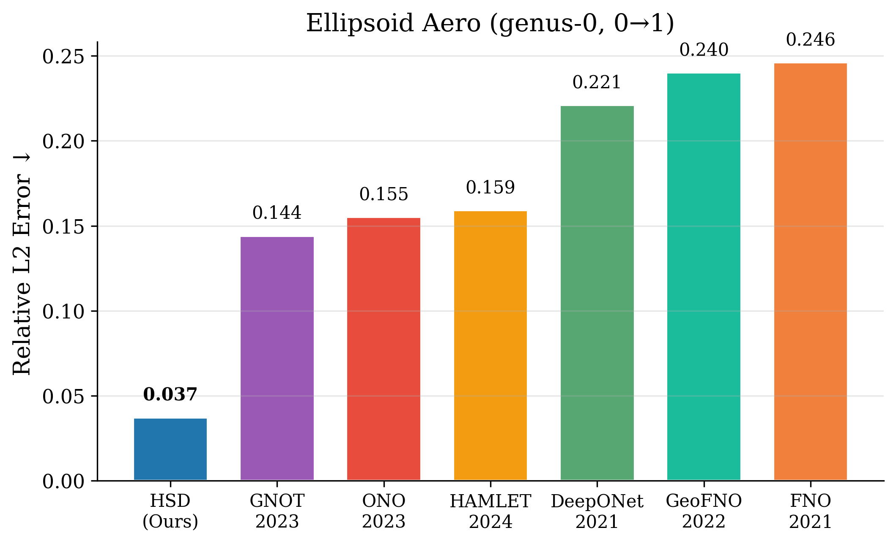
  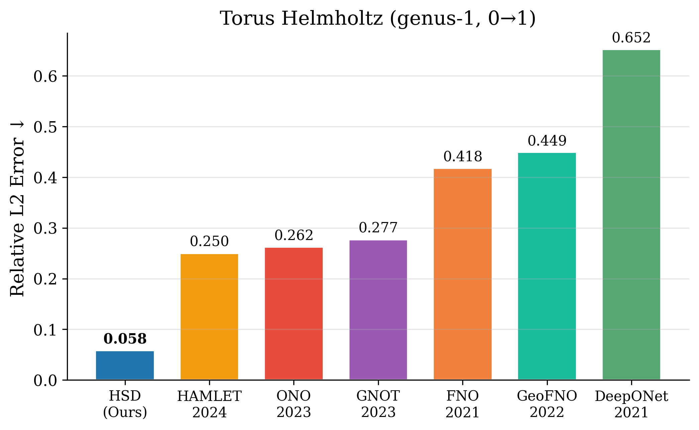
</p>

#### On Original Paper Tasks

| Task | HSD | GNOT'23 | ONO'23 | HAMLET'24 | Improvement |
|------|-----|---------|--------|-----------|-------------|
| External Aerodynamics | **0.038** | 0.089 | 0.081 | 0.123 | 53-69% |
| Magnetostatics | **0.021** | 0.050 | 0.051 | 0.071 | 58-70% |
| Toroidal Transport | **0.190** | 0.288 | 0.420 | 0.257 | 26-55% |

---

### Ablation 1: Input Modality Consistency

HSD is robust across all input representations — the same model achieves near-identical accuracy regardless of whether the input is a mesh, point cloud, or graph.

| Input Mode | Ellipsoid | Torus |
|------------|-----------|-------|
| Mesh | 0.036 | 0.056 |
| Point Cloud | 0.039 | 0.054 |
| Graph | 0.036 | 0.057 |
| **Spread** | **0.003** | **0.003** |

Variation < 0.5% across all three modes. The spectral decomposition is intrinsic to the simplicial geometry, not the input encoding.

<p align="center">
  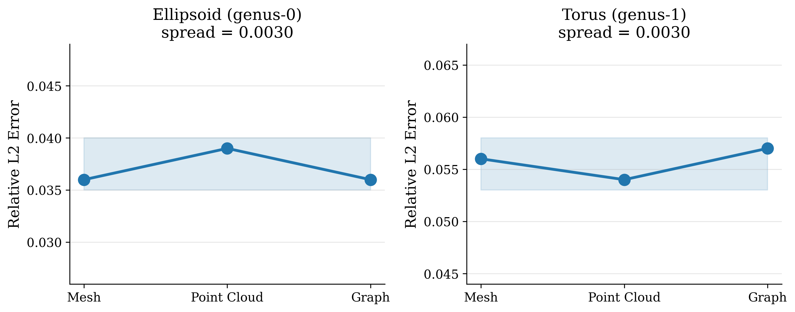
</p>

---

### Ablation 2: Pseudo-Spectral Bilinear Layer

The pseudo-spectral bilinear layer introduces explicit de Rham cross-form interactions (grad/curl coupling), improving performance significantly:

| Layer Type | Ellipsoid | Torus |
|------------|-----------|-------|
| Plain MLP | 0.037 | 0.056 |
| **Spectral Bilinear** | **0.026** | **0.049** |
| **Improvement** | **+30%** | **+13%** |

<p align="center">
  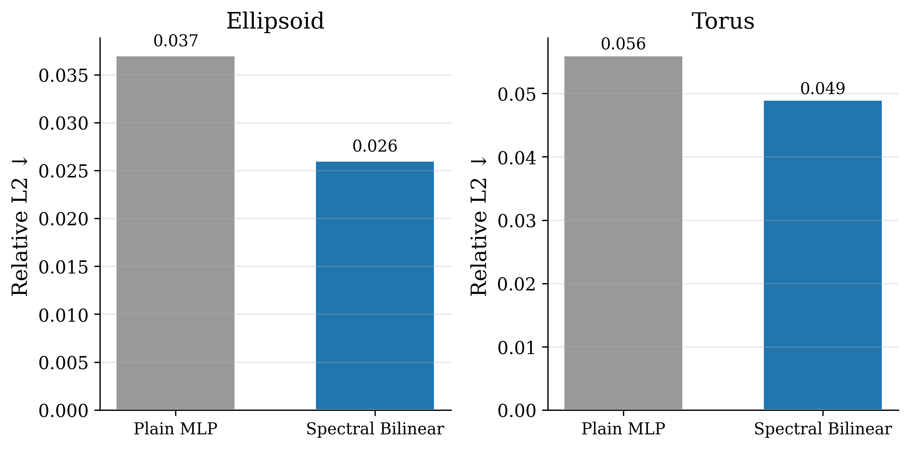
</p>

---

### Ablation 3: Whitney-KDE Spatial Encoding

Mesh-aware Whitney form interpolation + KDE smoothing outperforms raw Euclidean embedding by 12-14%:

| Spatial Encoding | Ellipsoid | Torus |
|-----------------|-----------|-------|
| **Whitney-KDE** | **0.037** | **0.058** |
| Raw Euclidean 3D | 0.042 | 0.065 |

---

### Ablation 4: Spectral Basis Quality

Hodge Laplacian eigenbasis vs. geometry-only (RBF) vs. random orthogonal bases:

| Basis | Ellipsoid | Torus |
|-------|-----------|-------|
| **Hodge Laplacian** | **0.036** | **0.156** |
| RBF (geometry only) | 0.042 | 0.174 |
| Random orthogonal | 0.084 | 0.783 |

The Hodge basis encodes topology via boundary operators B₁, B₂ — **14-17% better** than geometry-only, **2.3-5x better** than random.

---

### Ablation 5: Hodge Spectral Component Decomposition

Isolating the three orthogonal components of the Hodge decomposition $\Omega^1 = \mathrm{im}(d_0) \oplus \mathrm{im}(\delta_1) \oplus \ker(\Delta_1)$. The exact (gradient) channel is constructed as $\hat{c}0 \cdot M{d_0}^\top$, where $M_{d_0} = \Phi_1^\top B_1 \Phi_0$ applies the boundary operator $B_1$ to the low-frequency 0-form eigenbasis $\Phi_0$, projecting the input into the curl-free subspace. The coexact (curl) channel is constructed via the co-boundary operator $B_2^\top$ applied to the low-frequency 2-form eigenbasis $\Phi_2$, capturing the divergence-free subspace. The harmonic channel retains only the near-zero eigenvalue modes of $\Delta_0$ ($\lambda < 10^{-6}$), encoding global topological structure. Results confirm that the three components provide complementary, non-redundant spectral information.

| Task | Full Hodge | Exact only | Coexact only | Harmonic only |
|------|------------|------------|--------------|---------------|
| Ellipsoid | **0.084** | 0.113 | 0.338 | 1.002 |
| Torus | **0.475** | 0.995 | 0.483 | 1.003 |

#### Findings

1. **No single Hodge component suffices.** Harmonic-only diverges on both tasks (rel L2 > 1.0). Exact-only collapses on the coexact-dominated Torus (0.995). Coexact-only collapses on the exact-dominated Ellipsoid (0.338). Only the full spectrum succeeds on both.

2. **The dominant component mirrors the ground truth Hodge energy distribution.** Ellipsoid (exact-dominated) requires the gradient channel — dropping it causes severe degradation (0.338). Torus (coexact-dominated) requires the curl channel — dropping it causes near-divergence (0.995). The boundary operator B₁ (gradient, d₀) and co-boundary operator B₂^T (curl, delta₁) each capture physically distinct, non-redundant spectral information.

3. **The full Hodge Laplacian L₁ = B₁B₁^T + B₂^TB₂ optimally balances both subspaces** — the exact channel is constructed from the boundary operator on the (k-1)-spectrum, the coexact channel from the co-boundary operator on the (k+1)-spectrum. Using both jointly ensures automatic adaptation to the task's Hodge energy distribution without task-specific tuning.

---

### 3D Vector Field Predictions

Predicted flux vector fields on the two benchmark geometries:

<p align="center">
  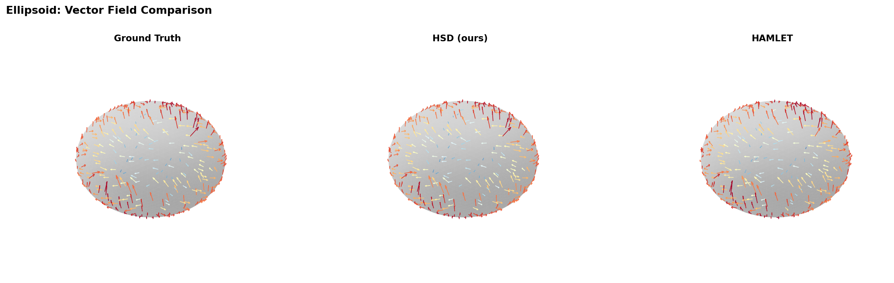
  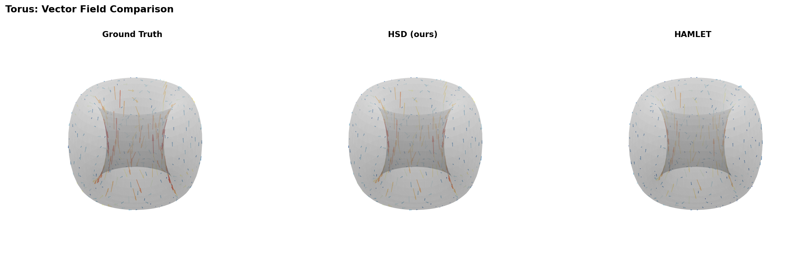
</p>

### Level Set Contours (Topological Fidelity)

Contour alignment between ground truth and HSD predictions, demonstrating preservation of topological structure:

<p align="center">
  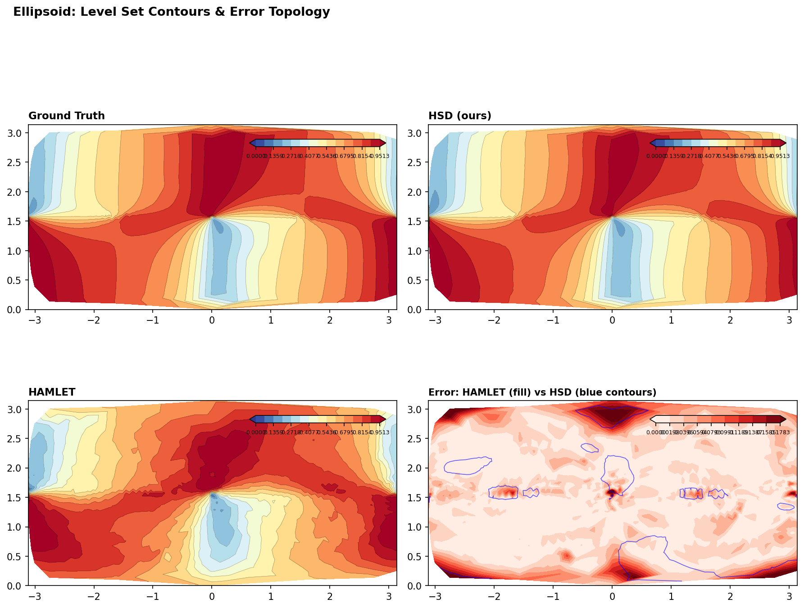
  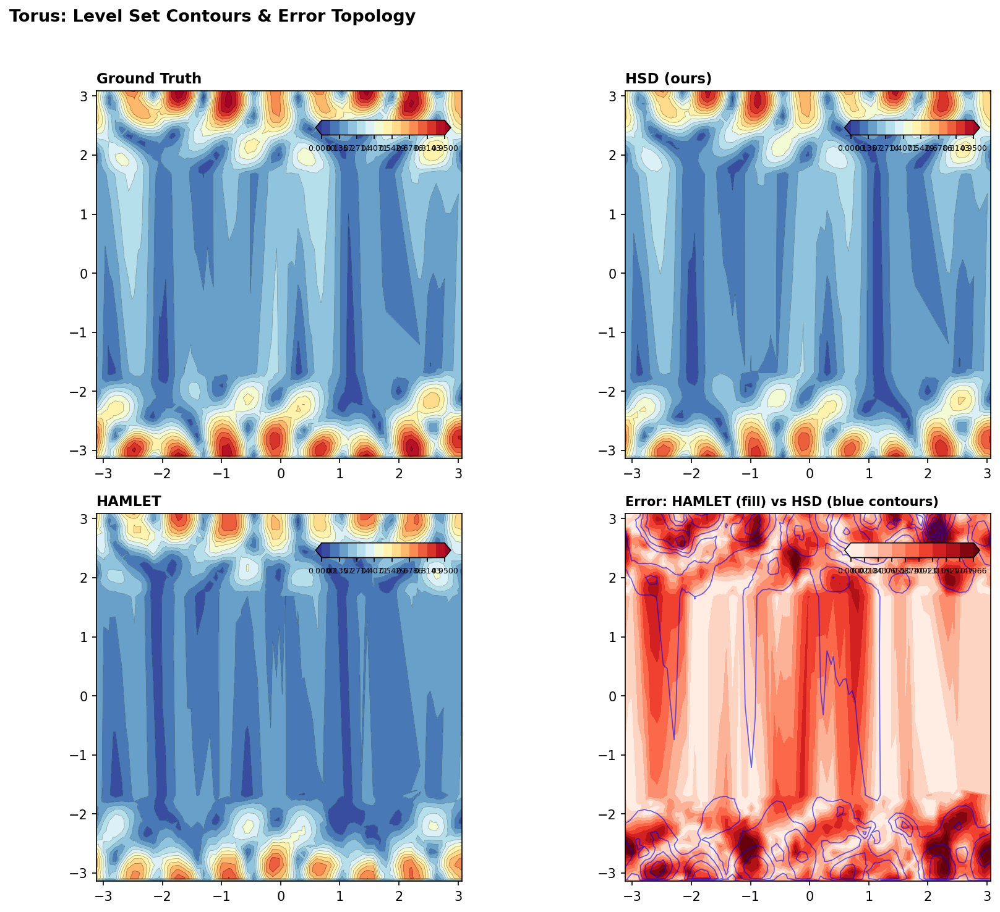
</p>

#### Original Tasks — Level Set and Error Visualization

<p align="center">
  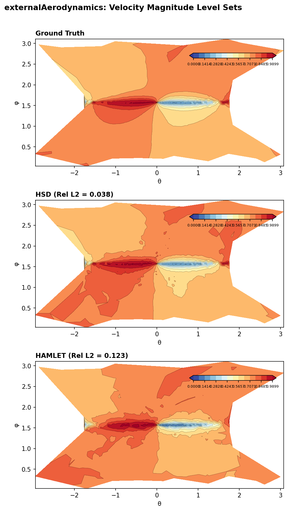
  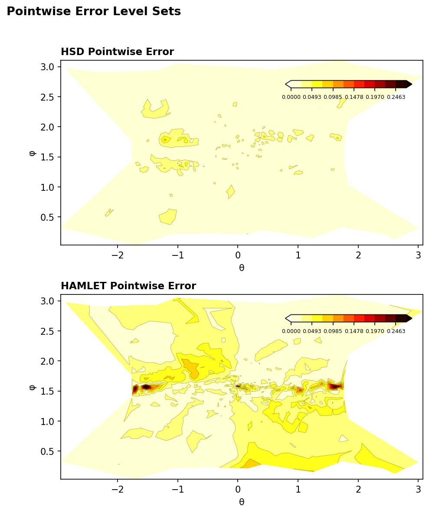
</p>

---

### Topological Data Analysis (TDA) Demonstrations

#### Betti Number Detection

HSD detects topological invariants (Betti numbers) with 100% accuracy directly from the Hodge Laplacian eigendecomposition — no supervised labels needed:

- **Ellipsoid (genus-0):** b₀=1, b₁=0, b₂=1, Euler characteristic chi=2
- **Torus (genus-1):** b₀=1, b₁=2, b₂=1, Euler characteristic chi=0

<p align="center">
  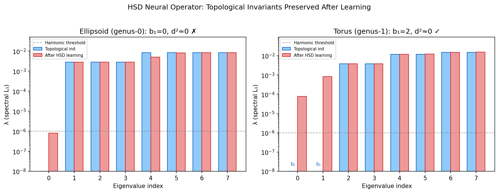
</p>

#### Learned Operator Topology Preservation

After training on PDE tasks, the learned operators preserve topological structure:
- Harmonic eigenvalues remain near zero (spectral gap 4.6x on torus)
- Exact sequence d^2 ~ 0 approximately maintained
- Spectral reliance gates show 72-75% dependence on spectral branch

#### Persistent Homology Analysis

<p align="center">
  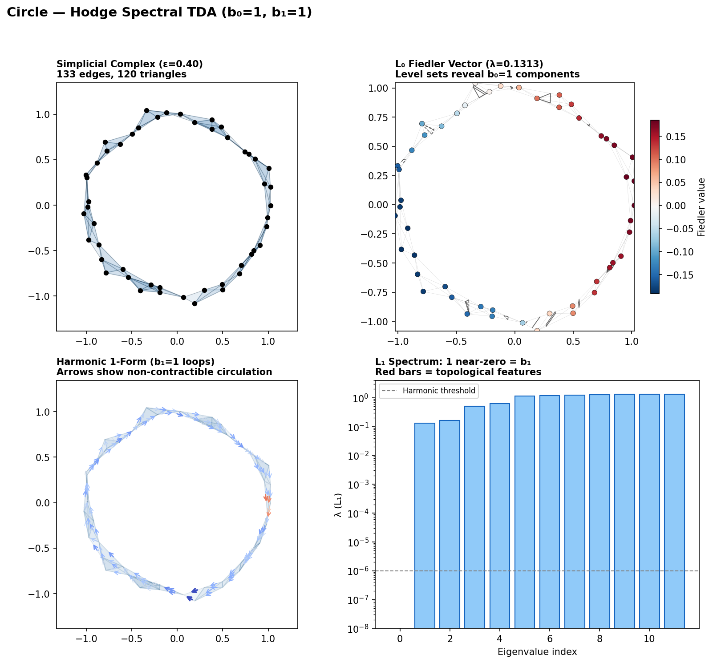
  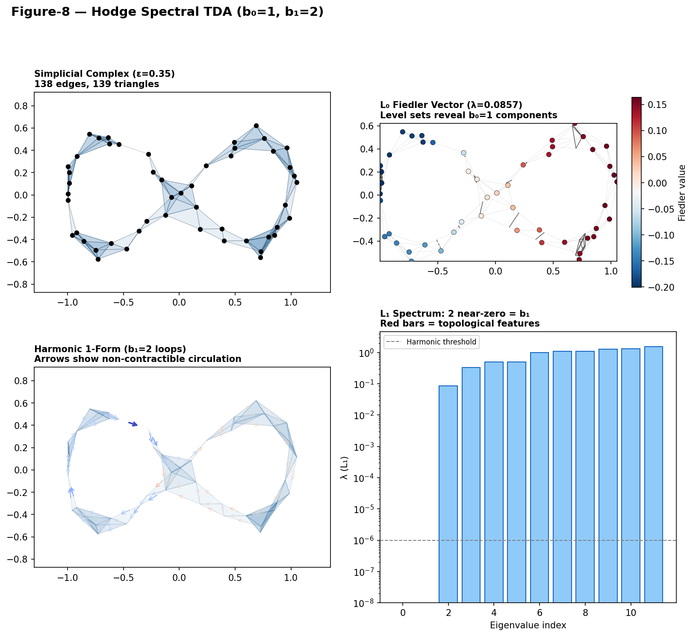
  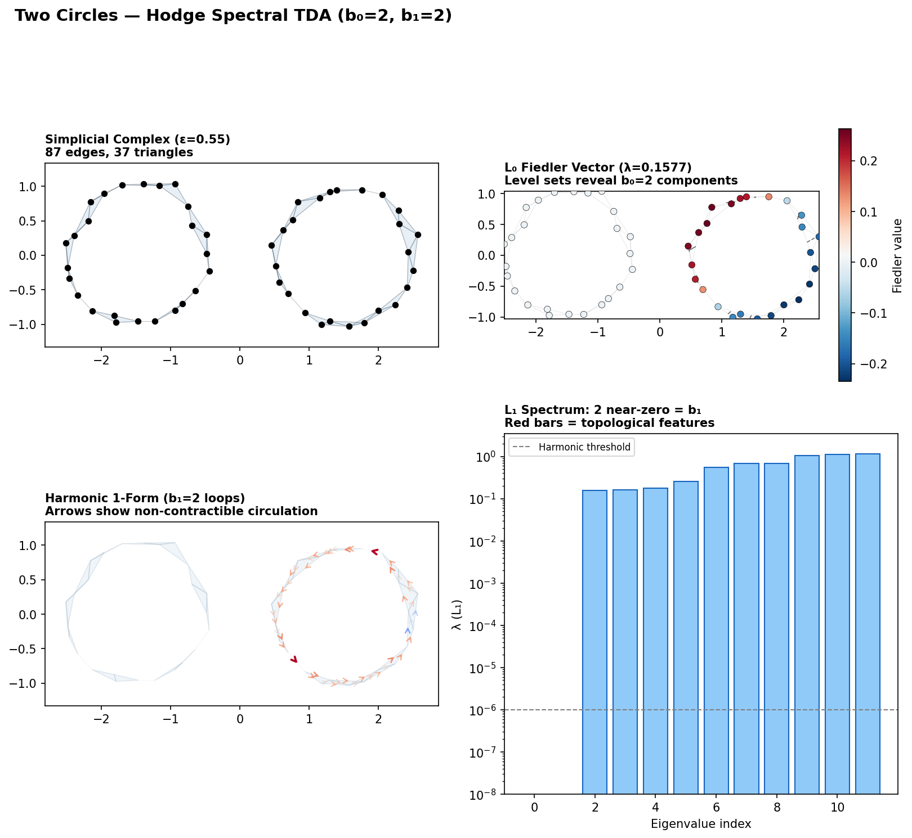
</p>

#### TDA Classifier — Betti Number Prediction from Point Clouds

Supervised classification of b₁ from spectral features extracted via HSD on Vietoris-Rips complexes (shapes: circle, figure-8, line, annulus):

<p align="center">
  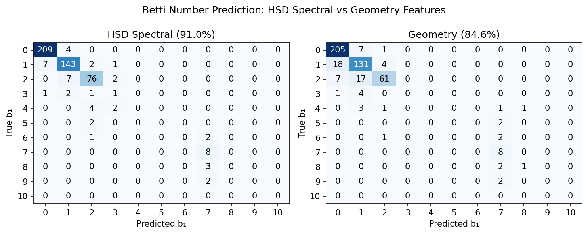
</p>

---

## Theoretical Foundation

### Differential Forms and the de Rham Complex

On a 2-dimensional manifold embedded in R^3:

```
Omega^0(M) --d0--> Omega^1(M) --d1--> Omega^2(M)
   |                  |                  |
0-forms           1-forms            2-forms
(scalars)        (vectors)          (densities)
```

### Hodge Decomposition Theorem

Any differential form omega on a compact Riemannian manifold admits a unique orthogonal decomposition:

```
omega = d(alpha) + delta(beta) + h
```

- `d(alpha)`: exact component (gradient of a potential)
- `delta(beta)`: coexact component (curl of a vector potential)
- `h`: harmonic component (encodes topology — dim = Betti number)

### Hodge Laplacians

```
L₀ = B₁^T B₁           (graph Laplacian on nodes)
L₁ = B₁ B₁^T + B₂^T B₂  (edge Laplacian)
L₂ = B₂ B₂^T            (face Laplacian)
```

### Spectral de Rham Operators

```
Md₀  = Phi₁^T B₁ Phi₀    (spectral gradient)
Mdelta₁ = Phi₀^T B₁^T Phi₁  (spectral divergence)
Md₁  = Phi₂^T B₂ Phi₁    (spectral curl)
Mdelta₂ = Phi₁^T B₂^T Phi₂  (spectral co-curl)
```

---

## Repository Structure

```
Hodge-Spectral-Duality/
├── hodge-spectral-operator/          # PyPI library (pip install hodge-spectral-operator)
│   ├── hodge_spectral/
│   │   ├── api.py                    # HodgeOperator: main user-facing API
│   │   ├── operators/spectral.py     # HighOrderSpectralOperators (Hodge Laplacians, eigenbases)
│   │   ├── adapters/adapters.py      # MeshAdapter, PointCloudAdapter, GraphAdapter
│   │   ├── models/unified.py         # UnifiedHSD dual-branch model
│   │   ├── models/dataset.py         # VectorFluxMapper, FluxFieldDataset
│   │   ├── models/baselines.py       # GNO, FNO3d, DeepONet baselines
│   │   └── data/                     # Data generation scripts
│   ├── examples/                     # Quickstart and benchmark examples
│   ├── pyproject.toml
│   └── README.md
│
├── HSD_addition_experiment/          # Supplementary experiments
│   ├── ablations/                    # All ablation study scripts
│   ├── baselines/                    # Extended baseline implementations (GNOT, ONO, HAMLET)
│   ├── original_tasks/               # Re-evaluation on original paper tasks
│   ├── tda_demo/                     # Topological Data Analysis demonstrations
│   ├── visualization/                # Figure generation scripts
│   ├── output/
│   │   ├── figures/                  # All generated visualizations
│   │   └── results/                  # All metrics in JSON format
│   ├── REPORT.md                     # Detailed experiment report
│   └── run_all.py                    # Master experiment runner
│
├── externalAerodynamics/             # Original task: ellipsoid aerodynamics (genus-0, 0→1)
├── magnetostatics/                   # Original task: magnetic flux on 3D surfaces (0→1)
├── toroidalTransport/                # Original task: advection-diffusion on torus (genus-1, 0→0)
└── README.md
```

---

## Installation

```bash
conda create -n hsd python=3.10
conda activate hsd

pip install torch torchvision torchaudio --index-url https://download.pytorch.org/whl/cu118
pip install numpy scipy scikit-learn matplotlib pyvista toponetx

# Install the library
pip install hodge-spectral-operator
```

---

## License

MIT

## Acknowledgments

- [TopoNetX](https://github.com/pyt-team/TopoNetX) for simplicial complex operations
- [PyVista](https://pyvista.org/) for 3D visualization
